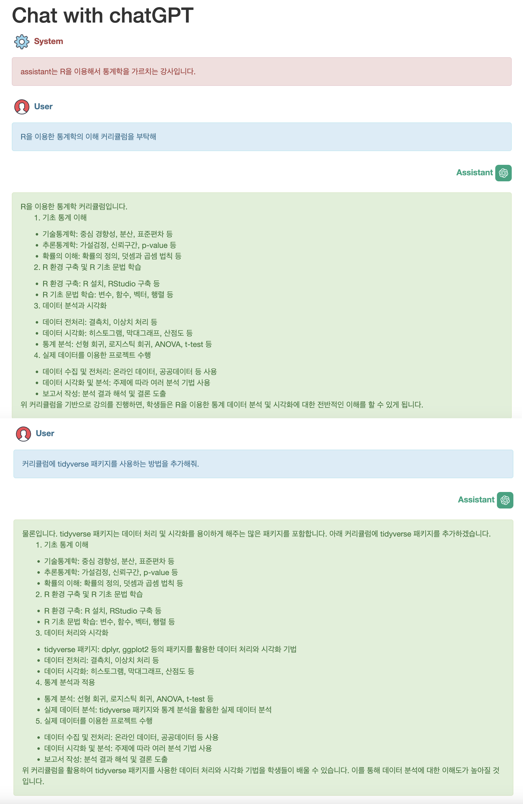

<!-- README.md is generated from README.Rmd. Please edit that file -->

# bitGPT 

## Overview

chatGPT를 보다 쉽게 사용할 수 있는, 그리고 한국어를 지원하는 `bitGPT`.

Features:

- open API key를 관리 기능으로 인한 손쉬운 서비스 인터페이싱
  - OpenAI의 API key
  - Naver 파파고의 client ID와 secret
- OpenAI의 채팅 자동 완성
- OpenAI의 텍스트 자동 완성
  - 한국어 프롬프트는 영어 프롬프트로 번역되어 질의하고 한글 결과 반환  
- OpenAI의 이미지 프로세싱
  - 이미지 생성
    - 영어 프롬프트와 한국어 프롬프트 지원
    - 한국어 프롬프트는 영어 프롬프트로 번역되어 질의
  - 이미지 편집
    - 영어 프롬프트와 한국어 프롬프트 지원
    - 한국어 프롬프트는 영어 프롬프트로 번역되어 질의  
  - 이미지 변형
- 음성의 녹취를 위한 오디오 녹음 기능  
- OpenAI의 STT(Speech to Text)
- Naver 파파고의 텍스트 번역기

## Install bitGPT

github 리파지토리로부터 다음의 명령어로 패키지를 설치합니다.:

``` r
devtools::install_github("bit2r/bitGPT")
```

## Prepare API keys

chatGPT를 사용하기 위해서는
[OpenAI](https://platform.openai.com/account/api-keys) 링크에서
`회원을 가입`하고 `OpenAI API key`를 발급받아야 합니다. **가입 후 첫
3달은 18 US 달러 credit이 무료이나, 이후에는 유료임을 인지하고
진행**하시기 바랍니다.

또한 한국어 환경으로 좀 더 편안한 사용을 위해서는
`Naver 파파고 API key`도 준비해야 합니다. [오픈 API
이용신청](https://developers.naver.com/apps/#/register?api=ppg_n2mt)
링크에서 `애플리케이션 등록(API 이용신청)`을 통해서 API key를 발급받아야
합니다.

### OpenAI API key 등록

API key는 공유되어서는 안됩니다. 예시에서는 OpenAI API key가
XXXXXXXXXXX임을 가정하였습니다.

`regist_openai_key()`를 한번 수행하면, 번거롭게 매번 세션마다 API key를
설정할 필요가 없습니다.

``` r
library(bitGPT)

# 실제 사용자가 할당받은 openai API key를 사용합니다.
regist_openai_key("XXXXXXXXXXX")
```

만약에 개인 컴퓨터가 아닌 여러 사용자가 사용하는 환경에 bitGPT 패키지를
설치한 경우라면, API key의 보안을 위해서 `regist_openai_key()`대신
`set_openai_key()`를 사용하세요.

`set_openai_key()`는 OpenAI API key를 R System environment에 설정하기
때문에 세션이 종료되고 다시 R을 구동해서 새로운 세션이 생기면,
재설정해야 합니다.

``` r
# 실제 사용자가 할당받은 openai API key를 사용합니다.
set_openai_key("XXXXXXXXXXX")
```

### Naver 파파고 API key 등록

Naver 파파고 API key는 `client ID`와 `client secret`로 구성되어
있습니다. OpenAI API key와 유사한 방법으로 `regist_naver_key()`를 한번
수행하여 등록하거나, `set_naver_key()`로 세션 내에서 설정합니다.

``` r
# 실제 사용자가 할당받은 Naver API key로 등록합니다.
regist_naver_key(client_id = "XXXXXXXXXXX", client_secret = "XXXXXXXXXXX")
```

``` r
# 실제 사용자가 할당받은 Naver API key로 설정합니다.
set_naver_key(client_id = "XXXXXXXXXXX", client_secret = "XXXXXXXXXXX")
```

## Laguage translation

### 파파고 번역

`translate()`는 파파고 번역을 수행합니다.

``` r
translate(
  text = NULL,
  source = "ko",
  target = "en",
  client_id = Sys.getenv("NAVER_CLIENT_ID"),
  client_secret = Sys.getenv("NAVER_CLIENT_SECRET")
)
```

- text
  - character. 번역할 텍스트입니다.
- source
  - character. 번역할 텍스트 언어의 언어 코드입니다. 기본값은 “ko”로
    한국어를 번역합니다.
- target
  - character. 번역될 언어의 언어 코드입니다. 기본값은 “en”로 영어로
    번역합니다.
- client_id
  - character. Naver 파파고 API key의 client ID입니다.
- client_secret
  - character. Naver 파파고 API key의 client Secret입니다.

몇 개 문장을 번역해 봅니다.

``` r
text <- "빈센트 반 고흐 스타일로 일출과 갈매기를 그려줘"
translate(text)
#> [1] "Vincent van Gogh style, please draw sunrise and seagulls"

text <- "We’ve trained a model called ChatGPT which interacts in a conversational way. The dialogue format makes it possible for ChatGPT to answer followup questions, admit its mistakes, challenge incorrect premises, and reject inappropriate requests."
translate(text, "en", "ko")
#> [1] "우리는 대화 방식으로 상호 작용하는 ChatGPT이라는 모델을 훈련시켰다. 대화 형식을 통해 ChatGPT는 후속 질문에 답변하고, 실수를 인정하고, 잘못된 전제에 도전하고, 부적절한 요청을 거부할 수 있습니다."
```

## Chat completion

### Create chat completion with chatGPT

`chatGPT`를 이용해서 대화형 인터페이스를 만들 수 있습니다.

주어진 대화 히스토리를 기반으로, 대화를 지속하는 데 필요한 다음 문장을
생성합니다. 이 API는 이전 대화 히스토리를 계속해서 분석하고, 대화를
나아가는 데 필요한 정보를 자동으로 추론합니다.

여러분은 다음의 `chat_completion()`로 원하는 대화를 만들어 나갈 수
있습니다.

``` r
chat_completion(
  messages = NULL,
  model = c("gpt-3.5-turbo", "gpt-3.5-turbo-0301"),
  temperature = 1,
  top_p = 1,
  n = 1,
  stream = FALSE,
  stop = NULL,
  max_tokens = NULL,
  presence_penalty = 0,
  frequency_penalty = 0,
  logit_bias = NULL,
  user = NULL,
  type = c("messages", "console", "viewer"),
  openai_api_key = Sys.getenv("OPENAI_API_KEY")
)
```

- messages
  - character. 채팅을 위한 메시지로 영문과 국문 모두 가능합니다.
- model
  - character. Chat completion에 사용할 OpenAI의 모델로,
    “gpt-3.5-turbo”, “gpt-3.5-turbo-0301”에서 선택합니다. 기본값은
    “gpt-3.5-turbo”입니다.
- temperature
  - numeric. 0에서 2 사이에서 사용할 샘플링 온도. 0.8과 같이 값이 높으면
    출력이 더 무작위적이고, 0.2와 같이 값이 낮으면 더 집중적이고
    결정론적인 출력이 됩니다. 일반적으로 이 값 또는 top_p를 변경하는
    것이 좋지만 둘 다 변경하는 것은 권장하지 않습니다.
- top_p
  - numeric. 온도를 이용한 샘플링의 대안으로, 핵 샘플링이라고 하며,
    모델이 상위_p 확률 질량을 가진 토큰의 결과를 고려합니다. 따라서
    0.1은 상위 10% 확률 질량을 구성하는 토큰만 고려한다는 의미입니다.
    일반적으로 이 값이나 temperature를 변경하는 것을 권장하지만 둘 다
    변경하는 것은 권장하지 않습니다.
- n
  - integer. 각 입력 메시지에 대해 생성할 채팅 완료 선택 항목의 수로
    기본값은 1입니다.
- stream
  - logical. 이 옵션을 설정하면 ChatGPT에서와 같이 부분 메시지가
    전송됩니다. 토큰은 사용 가능해지면 data-only server-sent 이벤트로
    전송되며, 스트림은 data의 DONE 메시지로 스트림이 종료됩니다.
- stop
  - character. API가 추가 토큰 생성을 중지하는 시퀀스는 1부터 최대
    4개까지입니다.
- max_tokens
  - integer. 생성된 답변에 허용되는 토큰의 최대 개수입니다. 기본적으로
    모델이 반환할 수 있는 토큰 수는 (4096 - 프롬프트 토큰).
- presence_penalty
  - numeric. -2.0에서 2.0 사이의 숫자. 양수 값은 지금까지 텍스트에
    등장한 토큰에 따라 새로운 토큰에 불이익을 주므로 모델이 새로운
    주제에 대해 이야기할 가능성이 높아집니다.
- frequency_penalty
  - numeric. -2.0에서 2.0 사이의 숫자. 양수 값은 지금까지 텍스트에서
    기존 빈도에 따라 새 토큰에 불이익을 주어 모델이 같은 줄을 그대로
    반복할 가능성을 낮춰줍니다.
- logit_bias
  - 완료에 지정된 토큰이 표시될 가능성을 수정. 토큰(토큰화기에서 토큰
    ID로 지정)을 -100에서 100 사이의 연관된 바이어스 값에 매핑하는 json
    객체를 받습니다. 수학적으로 바이어스는 샘플링 전에 모델에서 생성된
    로그에 추가되며, 정확한 효과는 모델마다 다르지만 -1에서 1 사이의
    값은 선택 가능성을 줄이거나 늘리고, -100 또는 100과 같은 값은 관련
    토큰을 금지하거나 독점적으로 선택하게 됩니다.
- user
  - character. 최종 사용자를 나타내는 고유 식별자로, OpenAI가 악용을
    모니터링하고 감지하는 데 도움이 될 수 있습니다.
- type
  - character. 반환하는 결과 타입. “messages”, “console”, “viewer”에서
    선택하며, 기본값인 “messages”는 결과를 assistant 컴포넌트에 추가한
    messages 객체를 반환합니다. “console”는 R 콘솔에 프린트 아웃되며,
    “viewer”는 HTML 포맷으로 브라우저에 출력됩니다. 만약 결과에 R 코드가
    chunk로 포함되어 있다면, 코드가 실행된 결과도 HTML 문서에
    포함됩니다.
- openai_api_key
  - character. OpenAI API key입니다. 만약 `regist_openai_key()`,
    `sett_openai_key()`로 API key를 설정했다면 이 인수값을 지정할
    필요없습니다.

**몇가지 방법으로의 채팅을 수행해 보겠습니다.**

### type = “console”

이 방법은 `message` 객체의 결과를 좀더 보기 좋게 콘솔에 출력할 때
사용합니다.

``` r
> chat_completion("네 이름은 뭐니?", type = "console")
══ Chat with chatGPT ══════════════════════════════════════════════════════ user ══
네 이름은 뭐니?

══ Chat with chatGPT ═════════════════════════════════════════════════ assistant ══
제 이름은 OpenAI Assistive입니다. 저는 OpenAI의 인공지능 어시스턴트입니다.
```

``` r
> chat_completion("미세먼지가 많은 날은 어떻게 준비해야할까?", type = "console")
══ Chat with chatGPT ══════════════════════════════════════════════════════ user ══
미세먼지가 많은 날은 어떻게 준비해야할까?

══ Chat with chatGPT ═════════════════════════════════════════════════ assistant ══
미세먼지가 많은 날에는 다음과 같은 준비를 하면 좋습니다.

1. 마스크 착용 : 미세먼지를 막기 위해 마스크를 착용해야 합니다. 미세먼지가 심한 날에는 KF94 등급 이상의 마스크를 선택해야 합니다.

2. 실내 환기 방지 : 실내 공기를 집중적으로 정화하기 위해 창문, 문을 닫고 에어컨, 공기청정기를 돌리는 것이 좋습니다.

3. 외출 제한 : 미세먼지 농도가 매우 높은 날에는 가능한 실내에서 활동을 하는 것이 좋으며, 외출이 필요한 경우에는 마스크를 꼭 착용해야 합니다.

4. 적정한 수분 섭취 : 미세먼지로 인해 목이 건조해지는 경우가 많으므로, 충분한 수분을 섭취해 목을 적정한 상태로 유지해야 합니다.

5. 눈 건강 보호 : 미세먼지는 눈에도 영향을 미칠 수 있으므로, 안경이나 눈을 보호할 수 있는 고글을 착용하는 것이 좋습니다. 두통, 결막염 등이 있는 경우 병원 선생님 상담을 권장합니다.
```

``` r
> chat_completion("근의 공식을 설명해줘", type = "console")
══ Chat with chatGPT ══════════════════════════════════════════════════════ user ══
근의 공식을 설명해줘

══ Chat with chatGPT ═════════════════════════════════════════════════ assistant ══
근의 공식은 다음과 같습니다.

ax^2 + bx + c = 0 (a ≠ 0)라는 이차방정식이 주어졌을 때, 이 방정식의 근은 다음과 같은 공식을 이용하여 계산할 수 있습니다.

x = (-b ± √(b^2 - 4ac)) / 2a

여기에서,

- b는 이차항의 계수이며, x에 곱해진 계수의 합을 의미합니다.
- a는 이차항의 계수입니다.
- c는 상수항의 값입니다.
- √는 루트 기호를 나타냅니다.
- ±는 양수와 음수를 의미하는데, 이는 두 개의 식이 나올 수 있음을 나타냅니다.

이 공식을 이용하여 이차방정식의 근을 쉽게 구할 수 있습니다. 하지만 이 공식은 근의 개수에 따라 근의 실수, 허수, 중근 등으로 나눠져 있기 때문에 근을 구하기 전에 해당 방정식의 근의 개수가 어떤지 판별해야 합니다.
```

``` r
> chat_completion("피타고라스의 정리는 무엇이지?", type = "console")

피타고라스의 정리는 직각삼각형에서 빗변의 제곱이 나머지 두 변의 제곱의 합과 같다는 정리이다. 즉, $a^2+b^2=c^2$로 표현된다. 이러한 정리는 수학뿐만 아니라 공학, 물리학 등 다양한 분야에서 활용된다.
```

### type = “messages”

이 방법은 질문과 답을 서로 주고 받는 채팅을 구현할 때 유용합니다.
왜냐하면 반환하는 `messages` 객체에는 주고 받은 메시지와 메시지에 대한
role이 리스트로 들어 있기 때문입니다.

bitGPT 패키지는 `messages` 객체를 핸들링하기 위한 다음의 함수(메소드)를
지원합니다.

- create_messages()
  - 메시지 객체 생성
- add()
  - 메시지 객체에 메시지 추가
- show()
  - 메시지 객체의 메시지 조회

다음은 단일 메시지의 사례입니다.

``` r
> chat_completion("R의 가장 큰 장점은 무엇일까?.", type = "messages")
[[1]]
[[1]]$role
[1] "user"

[[1]]$content
[1] "R의 가장 큰 장점은 무엇일까?."


[[2]]
[[2]]$role
[1] "assistant"

[[2]]$content
[1] "R의 가장 큰 장점은 데이터 분석과 시각화를 위한 강력한 도구들이 풍부하게 제공된다는 것입니다. R은 무료로 제공되는 오픈소스 소프트웨어로서, 다양한 패키지와 라이브러리를 활용하여 다양한 분석 및 시각화 기능을 구현할 수 있습니다. 이는 데이터 과학자 및 통계학자들이 데이터를 보다 쉽고 빠르게 분석, 시각화하며, 데이터에 포함된 패턴 및 트렌드를 쉽게 파악할 수 있다는 장점을 가지고 있습니다. 추가적으로 R은 통계학적 측면에서 강하며, 통계 분석 및 모델링을 위한 강력한 기능들을 제공하고 있습니다. 이는 데이터 과학 분야에서 매우 유용하다고 할 수 있습니다."


attr(,"class")
[1] "messages" "list" 
```

`messages` 객체를 만들어서 채팅을 수행하려 합니다.

``` r
> # 메시지 객체로 메시지를 정의하는 사례
> msg <- create_messages(user = "R을 이용한 통계학의 이해 커리큘럼을 부탁해",
+                        system = "assistant는 R을 이용해서 통계학을 가르치는 강사입니다.")
> # 메시지 객체로 반환
> answer <- chat_completion(msg, type = "messages")
> answer
[[1]]
[[1]]$role
[1] "system"

[[1]]$content
[1] "assistant는 R을 이용해서 통계학을 가르치는 강사입니다."


[[2]]
[[2]]$role
[1] "user"

[[2]]$content
[1] "R을 이용한 통계학의 이해 커리큘럼을 부탁해"


[[3]]
[[3]]$role
[1] "assistant"

[[3]]$content
[1] "R을 이용한 통계학 커리큘럼입니다.\n\n1. 기초 통계 이해\n- 기술통계학: 중심 경향성, 분산, 표준편차 등\n- 추론통계학: 가설검정, 신뢰구간, p-value 등\n- 확률의 이해: 확률의 정의, 덧셈과 곱셈 법칙 등\n\n2. R 환경 구축 및 R 기초 문법 학습\n- R 환경 구축: R 설치, RStudio 구축 등\n- R 기초 문법 학습: 변수, 함수, 벡터, 행렬 등\n\n3. 데이터 분석과 시각화\n- 데이터 전처리: 결측치, 이상치 처리 등\n- 데이터 시각화: 히스토그램, 막대그래프, 산점도 등\n- 통계 분석: 선형 회귀, 로지스틱 회귀, ANOVA, t-test 등\n\n4. 실제 데이터를 이용한 프로젝트 수행\n- 데이터 수집 및 전처리: 온라인 데이터, 공공데이터 등 사용\n- 데이터 시각화 및 분석: 주제에 따라 여러 분석 기법 사용\n- 보고서 작성: 분석 결과 해석 및 결론 도출\n\n위 커리큘럼을 기반으로 강의를 진행하면, 학생들은 R을 이용한 통계 데이터 분석 및 시각화에 대한 전반적인 이해를 할 수 있게 됩니다."


attr(,"class")
[1] "messages" "list"   
```

`show()` 함수를 이용하면 보기좋게 메시지를 살펴볼 수 있습니다.

``` r
> show(answer)
══ Chat with chatGPT ════════════════════════════════════════════════════ system ══
assistant는 R을 이용해서 통계학을 가르치는 강사입니다.

══ Chat with chatGPT ══════════════════════════════════════════════════════ user ══
R을 이용한 통계학의 이해 커리큘럼을 부탁해

══ Chat with chatGPT ═════════════════════════════════════════════════ assistant ══
R을 이용한 통계학 커리큘럼입니다.

1. 기초 통계 이해
- 기술통계학: 중심 경향성, 분산, 표준편차 등
- 추론통계학: 가설검정, 신뢰구간, p-value 등
- 확률의 이해: 확률의 정의, 덧셈과 곱셈 법칙 등

2. R 환경 구축 및 R 기초 문법 학습
- R 환경 구축: R 설치, RStudio 구축 등
- R 기초 문법 학습: 변수, 함수, 벡터, 행렬 등

3. 데이터 분석과 시각화
- 데이터 전처리: 결측치, 이상치 처리 등
- 데이터 시각화: 히스토그램, 막대그래프, 산점도 등
- 통계 분석: 선형 회귀, 로지스틱 회귀, ANOVA, t-test 등

4. 실제 데이터를 이용한 프로젝트 수행
- 데이터 수집 및 전처리: 온라인 데이터, 공공데이터 등 사용
- 데이터 시각화 및 분석: 주제에 따라 여러 분석 기법 사용
- 보고서 작성: 분석 결과 해석 및 결론 도출

위 커리큘럼을 기반으로 강의를 진행하면, 학생들은 R을 이용한 통계 데이터 분석 및 시각화에 대한 전반적인 이해를 할 수 있게 됩니다.
```

### type = “viewer”

이 방법은 답변의 결과에 R 코드가 포함되어 있을 때 유용합니다. 반환된
결과를 R 마크다운으로 수행하여 HTML로 만든 후 브라우저에 띄워줍니다.

다만, 경우에 따라서 답변의 결과 포함된 R 코드가 실행 중에 에러가 발생할
수 있는 불완전한 Pseudo 코드일 수 있습니다.

앞서 chatGPT assistant의 답변에 부족함이 보여서, 커리큘럼에 tidyverse
패키지에 대한 내용을 추가하려 합니다. 그래서 `add()` 함수로 이전 질문의
결과에 추가 질문을 추가합니다.

``` r
# 반환받은 메시지 객체에 질의를 위한 user role의 메시지 추가
> msg <- add(answer, user = "커리큘럼에 tidyverse 패키지를 사용하는 방법을 추가해줘.")
```

추가된 질문은 type 인수를 “viewer”로 설정하였습니다. 그래서 브라우저로
결과가 출력되겠지만, 할당 연산자를 이용해서 결과인 `message` 객체를
저장해둘 수도 있습니다.

``` r
# 이전 메시지를 포함하여 추가 질의
> answer2 <- chat_completion(msg, type = "viewer")
```

이 코드가 실행되면, 다음 그림처럼 메시지들이 웹 브라우저에 출력됩니다.

<figure>

<figcaption aria-hidden="true">결과의 HTML 프라우징 화면</figcaption>
</figure>

할당해 두었던 `message` 객체인 answer2를 다음처럼 `show()` 함수로 보기
좋게 출력할 수도 있고, 메시지를 추가해서 다시 질의할 수도 있습니다.

``` r
> show(answer2)
══ Chat with chatGPT ════════════════════════════════════════════════════ system ══
assistant는 R을 이용해서 통계학을 가르치는 강사입니다.

══ Chat with chatGPT ══════════════════════════════════════════════════════ user ══
R을 이용한 통계학의 이해 커리큘럼을 부탁해

══ Chat with chatGPT ═════════════════════════════════════════════════ assistant ══
R을 이용한 통계학 커리큘럼입니다.

1. 기초 통계 이해
- 기술통계학: 중심 경향성, 분산, 표준편차 등
- 추론통계학: 가설검정, 신뢰구간, p-value 등
- 확률의 이해: 확률의 정의, 덧셈과 곱셈 법칙 등

2. R 환경 구축 및 R 기초 문법 학습
- R 환경 구축: R 설치, RStudio 구축 등
- R 기초 문법 학습: 변수, 함수, 벡터, 행렬 등

3. 데이터 분석과 시각화
- 데이터 전처리: 결측치, 이상치 처리 등
- 데이터 시각화: 히스토그램, 막대그래프, 산점도 등
- 통계 분석: 선형 회귀, 로지스틱 회귀, ANOVA, t-test 등

4. 실제 데이터를 이용한 프로젝트 수행
- 데이터 수집 및 전처리: 온라인 데이터, 공공데이터 등 사용
- 데이터 시각화 및 분석: 주제에 따라 여러 분석 기법 사용
- 보고서 작성: 분석 결과 해석 및 결론 도출

위 커리큘럼을 기반으로 강의를 진행하면, 학생들은 R을 이용한 통계 데이터 분석 및 시각화에 대한 전반적인 이해를 할 수 있게 됩니다.

══ Chat with chatGPT ══════════════════════════════════════════════════════ user ══
커리큘럼에 tidyverse 패키지를 사용하는 방법을 추가해줘.

══ Chat with chatGPT ═════════════════════════════════════════════════ assistant ══
물론입니다. tidyverse 패키지는 데이터 처리 및 시각화를 용이하게 해주는 많은 패키지를 포함합니다. 아래 커리큘럼에 tidyverse 패키지를 추가하겠습니다.

1. 기초 통계 이해
- 기술통계학: 중심 경향성, 분산, 표준편차 등
- 추론통계학: 가설검정, 신뢰구간, p-value 등
- 확률의 이해: 확률의 정의, 덧셈과 곱셈 법칙 등

2. R 환경 구축 및 R 기초 문법 학습
- R 환경 구축: R 설치, RStudio 구축 등
- R 기초 문법 학습: 변수, 함수, 벡터, 행렬 등

3. 데이터 처리와 시각화
- tidyverse 패키지: dplyr, ggplot2 등의 패키지를 활용한 데이터 처리와 시각화 기법
- 데이터 전처리: 결측치, 이상치 처리 등
- 데이터 시각화: 히스토그램, 막대그래프, 산점도 등

4. 통계 분석과 적용
- 통계 분석: 선형 회귀, 로지스틱 회귀, ANOVA, t-test 등
- 실제 데이터 분석: tidyverse 패키지와 통계 분석을 활용한 실제 데이터 분석

5. 실제 데이터를 이용한 프로젝트 수행
- 데이터 수집 및 전처리: 온라인 데이터, 공공데이터 등 사용
- 데이터 시각화 및 분석: 주제에 따라 여러 분석 기법 사용
- 보고서 작성: 분석 결과 해석 및 결론 도출

위 커리큘럼을 활용하여 tidyverse 패키지를 사용한 데이터 처리와 시각화 기법을 학생들이 배울 수 있습니다. 이를 통해 데이터 분석에 대한 이해도가 높아질 것입니다.
```

## Image processing

### Create image with chatGPT

`chatGPT`를 이용해서, 생성할 이미지를 설명하는 프롬프트에 부합하는
이미지를 생성할 수 있습니다.

여러분은 다음의 `draw_img()`로 원하는 그림을 그리는 화가가 될 수
있습니다.

``` r
draw_img(
  prompt,
  ko2en = TRUE,
  n = 1L,
  size = c("1024x1024", "256x256", "512x512"),
  type = c("url", "image", "file"),
  format = c("png", "jpeg", "gif"),
  path = "./",
  fname = "aidrawing",
  openai_api_key = Sys.getenv("OPENAI_API_KEY")
)
```

- prompt
  - character. 이미지 생성 명령을 수행할 프롬프트입니다. 그림을 그리고자
    하는 화가의 상상을 영어나 한글로 쓰면 됩니다.
- ko2en
  - logical. 프롬프트가 한국어일 때, 영어로 번역하여 질의하는 여부
    설정합니다. TRUE이면 한글 프롬프트를 영어로 번역하여 프롬프트를
    질의합니다. 한글로 프롬프트를 작성하면, 그려진 그림의 결과가 원하는
    결과를 만들지 못한 경험이 많습니다. 그래서 한글 프롬프트에서는
    반드시 TRUE로 지정하는 것이 좋습니다.
- n
  - integer. 생성할 이미지의 개수를 1과 10 사이의 정수로 지정합니다.
    기본값은 1로 하나의 그림을 그립니다.
- size
  - character. 생성할 이미지의 크기로 “1024x1024”, “256x256”,
    “512x512”에서 하나를 선택합니다. 정사각형 크기만 지원하며, 기본값은
    “1024x1024”입니다.
- type
  - character. 반환하는 이미지 타입을 다음 3가지에서 선택합니다.
    - “url” : 기본값으로 생성된 이미지에 접근할 수 있는 OpenAI의 URL을
      반환합니다.
    - “image” : 생성한 이미지를 R 환경의 플롯으로 출력합니다.
    - “file” : 이미지 파일을 생성합니다.
- format
  - character. 이미지 파일의 포맷으로 `type`의 값이 “file”일 경우만
    적용됩니다. “png”, “jpeg”, “gif”에서 선택하며, 기본값은 “png”입니다.
- path
  - character. 파일을 생성할 디렉토리 경로로 `type`의 값이 “file”일
    경우만 적용됩니다.
- fname
  - character. 경로와 확장자를 제외한 이미지 파일의 이름으로, `type`의
    값이 “file”일 경우만 적용됩니다.
- openai_api_key
  - character. OpenAI API key입니다. 만약 `regist_openai_key()`,
    `sett_openai_key()`로 API key를 설정했다면 이 인수값을 지정할
    필요없습니다.

**빈센트 반 고흐 스타일로 해변에서의 일출과 갈매기를 그려보겠습니다.**

영어 프롬프트로 그림을 그립니다. `ko2en` 인수값은 FALSE로 지정합니다. 이
예제는 그려진 이미지에 접근할 수 있는 URL을 반환합니다.

``` r
prompt_en <- "Draw a sunrise and a seagull in Vincent van Gogh style."
draw_img(prompt_en, ko2en = FALSE)
```

한글 프롬프트로 그림을 그립니다. 그려진 결과는 R 플롯으로 반환되므로
RStudio 환경이라면, `Plots` 패널에서 확인할 수 있습니다.

``` r
prompt_ko <- "빈센트 반 고흐 스타일로 일출과 갈매기를 그려줘"
draw_img(prompt_ko, type = "image")
```

파일로 출력하고 싶다면 `type`의 값을 “file”로 지정합니다. 파일의 경로와
이름을 지정하지 않았기 때문에, 현재의 working directory에
“aidrawing.png”라는 이름으로 생성됩니다.

``` r
draw_img(prompt_ko, type = "file")
```

그리는 그림의 모양은 매번 달라집니다. 다음은 고흐가 그린 일출과 갈매기
작품입니다.


### Edit image with chatGPT

`chatGPT`를 이용해서, 이미지를 편집할 수 있습니다.

여러분은 다음의 `draw_img_edit()`로 원하는 이미지의 특정 부분을 퍈집할
수 있습니다. 함수의 인수는 `draw_img_variation()`와 거의 유사합니다.
`image` 인수에 편집할 원래의 이미지 파일을, mask에 편집할 부분을
선택하는(mask) 이미지 파일을 지정하면 됩니다. 그리고 prompt에는 편집할
부분의 편집 내용을 기술합니다.

``` r
draw_img_edit(
  image,
  mask,
  prompt,
  ko2en = TRUE,
  n = 1L,
  size = c("1024x1024", "256x256", "512x512"),
  type = c("url", "image", "file"),
  format = c("png", "jpeg", "gif"),
  path = "./",
  fname = "aiedit",
  openai_api_key = Sys.getenv("OPENAI_API_KEY")
)
```

- image
  - character. 편집할 이미지 파일의 이름입니다.
- mask
  - character. 투명한(alpha 값이 0인 경우) 영역이 이미지를 편집하 위치를
    나타내는 추가 이미지로, 4MB 미만의 유효한 PNG 파일이어야 하며
    이미지와 크기가 같아야 합니다.
- prompt
  - character. 편집을 원하는 이미지에 대한 설명으로 최대 길이는
    1000자입니다.
- ko2en
  - logical. 프롬프트가 한국어일 때, 영어로 번역하여 질의하는 여부
    설정합니다. TRUE이면 한글 프롬프트를 영어로 번역하여 프롬프트를
    질의합니다. 한글로 프롬프트를 작성하면, 그려진 그림의 결과가 원하는
    결과를 만들지 못한 경험이 많습니다. 그래서 한글 프롬프트에서는
    반드시 TRUE로 지정하는 것이 좋습니다.
- n
  - integer. 생성할 이미지의 개수를 1과 10 사이의 정수로 지정합니다.
    기본값은 1로 하나의 그림을 그립니다.
- size
  - character. 생성할 이미지의 크기로 “1024x1024”, “256x256”,
    “512x512”에서 하나를 선택합니다. 정사각형 크기만 지원하며, 기본값은
    “1024x1024”입니다.
- type
  - character. 반환하는 이미지 타입을 다음 3가지에서 선택합니다.
    - “url” : 기본값으로 생성된 이미지에 접근할 수 있는 OpenAI의 URL을
      반환합니다.
    - “image” : 생성한 이미지를 R 환경의 플롯으로 출력합니다.
    - “file” : 이미지 파일을 생성합니다.
- format
  - character. 이미지 파일의 포맷으로 `type`의 값이 “file”일 경우만
    적용됩니다. “png”, “jpeg”, “gif”에서 선택하며, 기본값은 “png”입니다.
- path
  - character. 파일을 생성할 디렉토리 경로로 `type`의 값이 “file”일
    경우만 적용됩니다.
- fname
  - character. 경로와 확장자를 제외한 이미지 파일의 이름으로, `type`의
    값이 “file”일 경우만 적용됩니다.
- openai_api_key
  - character. OpenAI API key입니다. 만약 `regist_openai_key()`,
    `sett_openai_key()`로 API key를 설정했다면 이 인수값을 지정할
    필요없습니다.

`bitGPT` 패키지에는 “cloud.png” 파일을 제공하고 있습니다. 이 파일은
정사각형 규격의 이미지 파일로 다음과 같습니다.

<figure>

<figcaption aria-hidden="true">원 소스 이미지</figcaption>
</figure>

그리고 mask를 위한 파일로 “cloud_mask.png” 파일을 제공하고 있습니다. 이
파일 역시 정사각형 규격의 이미지 파일로 다음과 같습니다. 그리고 이미지의
크기는 “cloud.png” 파일과 동일합니다.

<figure>

<figcaption aria-hidden="true">마스크 이미지</figcaption>
</figure>

“cloud.png” 이미지 파일을 편집해 보겠습니다.

``` r
# 편집할 이미지
image <- system.file("images", "cloud.png", package = "bitGPT")

# Mask 이미지
mask <- system.file("images", "cloud_mask.png", package = "bitGPT")

# 이미지를 반환
draw_img_edit(image, mask, prompt = "하늘을 날아다니는 UFO", type = "image")
```

<figure>

<figcaption aria-hidden="true">편집된 이미지</figcaption>
</figure>

### Variate image with chatGPT

`chatGPT`를 이용해서, 이미지를 변형할 수 있습니다.

여러분은 다음의 `draw_img_variation()`로 원하는 이미지를 유사하게 다른
이미지를 변형할 수 있습니다. 함수의 인수는 `draw_img()`와 거의
유사합니다. `image` 인수에 변형하고자 할 원래의 이미지 파일을 지정하면
됩니다.

``` r
draw_img_variation(
  image,
  n = 1L,
  size = c("1024x1024", "256x256", "512x512"),
  type = c("url", "image", "file"),
  format = c("png", "jpeg", "gif"),
  path = "./",
  fname = "aivariation",
  openai_api_key = Sys.getenv("OPENAI_API_KEY")
)
```

앞에서 소개한 “cloud.png” 이미지 파일을 변형해 보겠습니다.

``` r
# 변형할 이미지
image <- system.file("images", "cloud.png", package = "bitGPT")

draw_img_variation(image, type = "image")
```

<figure>

<figcaption aria-hidden="true">변형된 이미지</figcaption>
</figure>

## Speech to text

### Speech to Text with chatGPT

`chatGPT`를 이용해서, 음성 오디오 파일로 STT(Speech to Text )를
수행합니다.

여러분은 `transcript_audio()`로 STT를 수행할 수 있습니다.

``` r
transcript_audio(
  file,
  language = "ko",
  openai_api_key = Sys.getenv("OPENAI_API_KEY")
)
```

- file
  - character. 음성 오디오 파일 이름을 지정합니다. 오디오 파일의 포맷은
    mp3, mp4, mpeg, mpga, m4a, wav, webm중 하나만 허용합니다.
- language
  - character. 음성 오디오 파일의 언어로 ISO-639-1 포맷으로 지정해야
    하며, 기본값은 한국어인 “ko”입니다. 다국어 음성파일을 지원합니다.
- openai_api_key
  - character. OpenAI API key입니다. 만약 `regist_openai_key()`,
    `sett_openai_key()`로 API key를 설정했다면 이 인수값을 지정할
    필요없습니다.

`bitGPT` 패키지에는 “korea_r\_user.m4a” 파일을 제공하고 있습니다. 이
파일은 `한국R사용자회` 소개하는 짧은 음성파일입니다. 성능이 좋지 않는
스피치의 텍스트 전환의 성능을 판단하기 위해서, 스피치의 성능은 높지 않게
생성했습니다. 잘못 발음하여 다시 발음하거나, 문장내에서 띄어 읽는 부분이
부자연스러운 곳도 있습니다.

``` r
# 음성 오디오 파일
speech <- system.file("audios", "korea_r_user.m4a", package = "bitGPT")

# 음성 오디오를 텍스트로 전환
transcript_audio(speech)
```

``` r
text 
"사단법인 한국R 사용자예는 디지털 분평 등 해소와 통계 대중화를 위해 2020년 설립되었습니다. 
오픈 통계 패키지 개발을 비롯하여 최근에 통계 및 데이터 과학 관련 오픈 전자책도 함께 제작하여 발간하고 있습니다. 
통계 패키지와 통계 및 데이터 과학 책은 사용자의 회원들의 자발적인 참여로 개발 및 유지 보수되고 있습니다. 
데이터 과학 분야의 인공지능 ai 체질 비트와 공존을 본격적으로 탐색하기 시작했습니다." 
```

스피치의 대상이 되는 원문 문장은 다음과 같습니다.

``` r
사단법인 한국 R 사용자회는 디지털 불평등 해소와 통계 대중화를 위해 2022년 설립되었습니다. 
오픈 통계 패키지 개발을 비롯하여 최근에 통계 및 데이터 과학 관련 오픈 전자책도 함께 제작하여 발간하고 있습니다. 
통계 패키지와 통계 및 데이터 과학 전자책은 사용자회 회원들의 자발적인 참여로 개발 및 유지보수 되고 있습니다. 
데이터 과학 분야 인공지능 AI chatGPT와 공존을 본격적으로 탐색하기 시작했습니다. 
```
